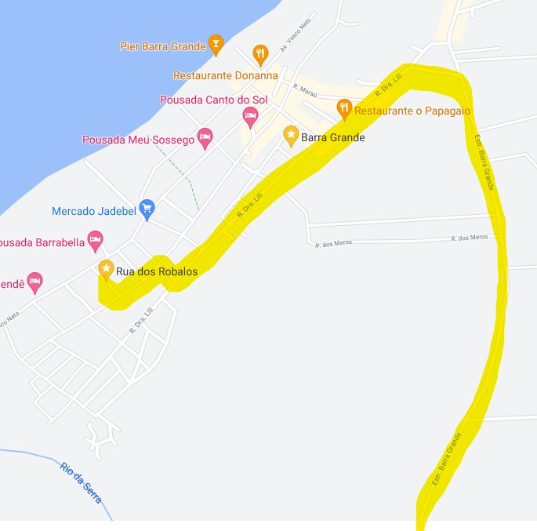

# Guia Rápido

::: tip Dica
Este é um **guia rápido** para o apartamento.

Mais informações disponíveis nos links do cabeçalho.
:::

## Localização

**Condomínio Vilaggio Di Maré AP.102 Bloco ???**

Rua dos Robalos, Vila de Barra Grande, Maraú, BA, CEP 45520-000

<iframe src="https://www.google.com/maps/embed?pb=!1m18!1m12!1m3!1d3873.0133772293443!2d-38.95808480447563!3d-13.898148226507127!2m3!1f0!2f0!3f0!3m2!1i1024!2i768!4f13.1!3m3!1m2!1s0x73e956e008065b9%3A0x36ab77e9d68bb65c!2sAP102.VilaggioDiMare%20-%20Mara%C3%BA%2C%20BA%2C%2045520-000!5e0!3m2!1sen!2sbr!4v1630117444465!5m2!1sen!2sbr" width="600" height="450" style="border:0;" allowfullscreen="" loading="lazy"></iframe>

Pontos de referênciaW próximos:

- Ao lado Pousada Barra Trip
- Em frente Pousada Barrabella

---

Mapa com rodovia BA-030

## O condomínio

### Fachada

Ao chegar no condomínio, existem 2 portões. Um para entrada (lado sul) e o de saída (norte)

Foto frente condomínio

Ao entrar no portão, virar à **esquerda**

### Bloco

O bloco onde fica o apartamento é o ??

Foto do bloco

### Garagem

Favor estacionar nas vagas ??????

Foto da garagem

## Entrando no Apto

Caso deseje fazer um check-in completo, acessar [este link](/checkin)

### Senha da Porta

1 - Para acionar a **fechadura eletrônica**, encoste a parte de trás da mão sobre a tela até ela acender. Pode ser que precise de mais de uma tentativa

2 - Assim que acender, digite **4488 e aperte \* para confirmar**

::: warning Câmera

**Desligar a câmera ao lado da TV**

Conforme descrito no [check-in](/checkin), esta câmera wifi serve para acompanharmos prestadores de serviços remotamente e deve ser religada ao fazer o [check-out](/checkout).

:::

### Wifi

::: tip INTERNET

O nome da rede é PANTANAL (ou PANTANAL-5G caso seu aparelho possibilite)

A senha é: pescador
:::

## Tomadas 220V

::: danger VOLTAGEM 220V

**TODAS AS TOMADAS SÃO 220V**

Não tem tomada 110V

:::

## Mais informações

Este foi o guia rápido.
Para mais informações sobre o apartamento [clique aqui](checkin)
